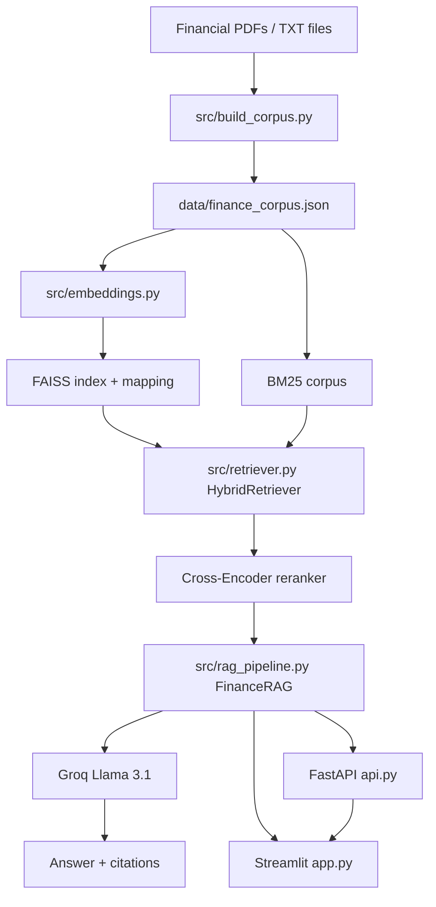

# Finance RAG System

A production-ready Retrieval-Augmented Generation (RAG) application for financial question answering. The system combines local financial documents, hybrid retrieval, cross-encoder reranking, and Groq-hosted Llama 3.1 answer generation behind both a FastAPI API and a Streamlit user interface.

## Project Overview

Finance RAG helps users ask natural-language questions over a curated financial knowledge base. It indexes local PDF/TXT content into retrievable chunks, searches them with dense and sparse retrieval, reranks the strongest candidates, and generates concise answers constrained to the retrieved context.

The existing retrieval and generation pipeline is intentionally preserved:

- FAISS dense vector retrieval
- BM25 sparse retrieval
- Hybrid score fusion
- Cross-Encoder reranking
- Groq Llama 3.1 generation
- Extractive fallback when `GROQ_API_KEY` is not configured

## Features

- FastAPI service with `GET /ask` and `POST /ask` endpoints.
- Streamlit chat UI for API-backed or local in-process answers.
- Ad-hoc PDF upload and in-session indexing from the UI.
- Hybrid retrieval using FAISS and BM25.
- Cross-Encoder reranking of candidate chunks.
- Source citations by document name and chunk number.
- Docker image that starts FastAPI and Streamlit together.
- `.env.example`, `.gitignore`, `.dockerignore`, and MIT license for deployment hygiene.

## Architecture Diagram



## Tech Stack

- **Language:** Python 3.11
- **API:** FastAPI, Uvicorn, Pydantic
- **UI:** Streamlit
- **Retrieval:** FAISS, rank-bm25
- **Embeddings:** Sentence Transformers (`sentence-transformers/all-MiniLM-L6-v2`)
- **Reranking:** Sentence Transformers Cross-Encoder (`cross-encoder/ms-marco-MiniLM-L-6-v2`)
- **Generation:** Groq Llama 3.1 (`llama-3.1-8b-instant`)
- **PDF parsing:** pypdf
- **Market data helper:** yfinance
- **Deployment:** Docker

## Installation

```bash
git clone <your-repo-url>
cd RAG
python -m venv .venv
source .venv/bin/activate
python -m pip install --upgrade pip
python -m pip install -r requirements.txt
```

> Dependency lock note: `requirements.txt` is intentionally a concise runtime dependency list. For stricter production reproducibility, generate and review a pinned lock file with your preferred tool, then rebuild and test the Docker image before deployment.

## Local Setup

1. Copy the sample environment file:

   ```bash
   cp .env.example .env
   ```

2. Add your Groq key to `.env` or export it in your shell:

   ```bash
   export GROQ_API_KEY="your_groq_api_key_here"
   ```

3. If you add or change local documents, place supported files in `data/raw_docs/` and rebuild the corpus:

   ```bash
   python src/build_corpus.py
   ```

4. Build or refresh embeddings and the FAISS index:

   ```bash
   python src/embeddings.py
   ```

## Environment Variables

| Variable | Required | Default | Purpose |
| --- | --- | --- | --- |
| `GROQ_API_KEY` | Yes for generated answers | unset | Enables Groq-hosted Llama 3.1 answer generation. Without it, the app returns an extractive fallback from retrieved context. |
| `FINANCE_RAG_API_URL` | No | `http://127.0.0.1:8000/ask` | Streamlit API-mode endpoint. |
| `API_PORT` | No | `8000` | FastAPI port used by the Docker command. |
| `STREAMLIT_PORT` | No | `8501` | Streamlit port used by the Docker command. |

`.env.example` includes only the required application configuration values:

```dotenv
GROQ_API_KEY=
FINANCE_RAG_API_URL=http://127.0.0.1:8000/ask
```

## Running FastAPI

```bash
uvicorn api:app --host 127.0.0.1 --port 8000
```

Health check:

```bash
curl http://127.0.0.1:8000/
```

Ask endpoint:

```bash
curl "http://127.0.0.1:8000/ask?query=How%20do%20interest%20rates%20affect%20bond%20prices%3F"
```

## Running Streamlit

In a second terminal, keep FastAPI running and start Streamlit:

```bash
streamlit run app.py
```

Open `http://localhost:8501` and keep the default API URL when using API mode: `http://127.0.0.1:8000/ask`.

## Docker Deployment

The Docker image installs runtime dependencies, builds the FAISS artifacts from the checked-in corpus during image build, creates a non-root runtime user, and starts FastAPI and Streamlit in the same container.

Build:

```bash
docker build -t finance-rag .
```

Run:

```bash
docker run --rm \
  -p 8000:8000 \
  -p 8501:8501 \
  -e GROQ_API_KEY=YOUR_KEY \
  finance-rag
```

Services:

- FastAPI: `http://localhost:8000`
- Streamlit: `http://localhost:8501`
- API query: `http://localhost:8000/ask?query=How%20do%20interest%20rates%20affect%20bond%20prices%3F`

## Example API Request

GET request:

```bash
curl -s "http://127.0.0.1:8000/ask?query=What%20does%20a%20central%20bank%20do%3F"
```

POST request:

```bash
curl -s -X POST "http://127.0.0.1:8000/ask" \
  -H "Content-Type: application/json" \
  -d '{"query":"What does a central bank do?"}'
```

Example response shape:

```json
{
  "query": "What does a central bank do?",
  "answer": "...",
  "citations": [
    {
      "pdf_filename": "finance_source.pdf",
      "chunk_number": 1
    }
  ]
}
```

## Example UI Screenshots

Add production screenshots here before publishing public documentation:

- `docs/screenshots/streamlit-chat.png` — Streamlit chat interface placeholder.
- `docs/screenshots/streamlit-upload.png` — PDF upload workflow placeholder.
- `docs/screenshots/api-docs.png` — FastAPI Swagger UI placeholder.

## Folder Structure

```text
.
├── api.py                     # FastAPI application
├── app.py                     # Streamlit UI
├── data/
│   ├── finance_corpus.json    # Checked-in retrieval corpus
│   └── finance_mapping.json   # Checked-in chunk metadata
├── evaluation/
│   └── evaluate.py            # Retrieval evaluation helper
├── scripts/
│   └── run_full_checks.sh     # Compile, indexing, RAG, evaluation, API smoke checks
├── src/
│   ├── build_corpus.py        # Local document ingestion
│   ├── embedder.py            # SentenceTransformer loader
│   ├── embeddings.py          # Embedding + FAISS artifact generation
│   ├── rag_pipeline.py        # RAG orchestration and Groq answer generation
│   ├── realtime_data.py       # yfinance helper
│   ├── retriever.py           # Hybrid FAISS + BM25 retrieval
│   └── text_processing.py     # Text cleanup/chunking/PDF extraction
├── .dockerignore
├── .env.example
├── .gitignore
├── Dockerfile
├── LICENSE
├── README.md
└── requirements.txt
```

## Checks

Compile Python files:

```bash
python -m compileall -q .
```

Run the full local smoke suite:

```bash
bash scripts/run_full_checks.sh
```

Run dependency import verification:

```bash
python - <<'PY'
import fastapi, faiss, groq, numpy, pydantic, pypdf, rank_bm25, requests, sentence_transformers, streamlit, torch, uvicorn, yfinance
print("dependency imports ok")
PY
```

## Future Improvements

- Add a reviewed pinned dependency lock file for reproducible releases.
- Add CI for compile checks, dependency import checks, and Docker build validation.
- Add production screenshots under `docs/screenshots/`.
- Add structured logging and metrics around retrieval, reranking, and answer latency.
- Add deployment-specific manifests for the chosen hosting platform.
- Add automated security scanning for base images and Python dependencies.
